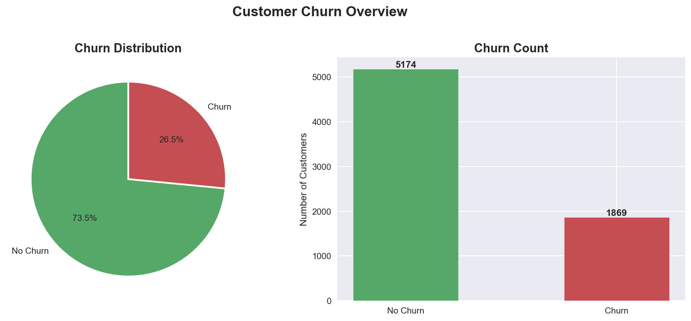
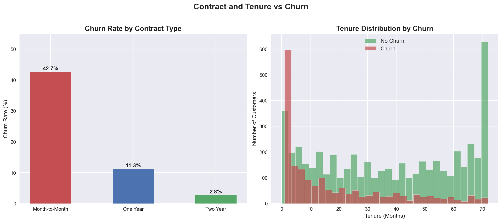
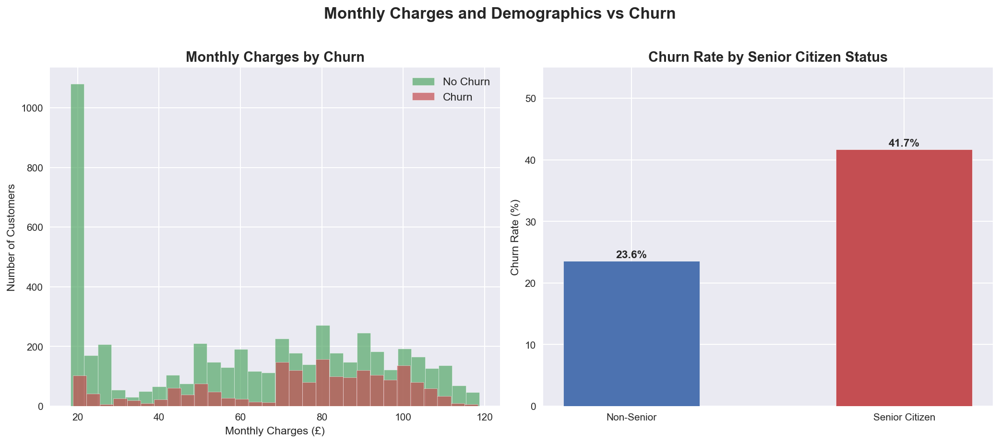
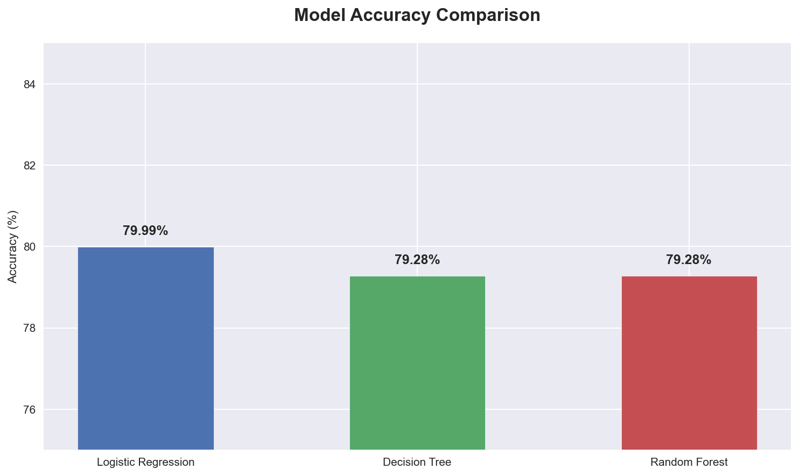
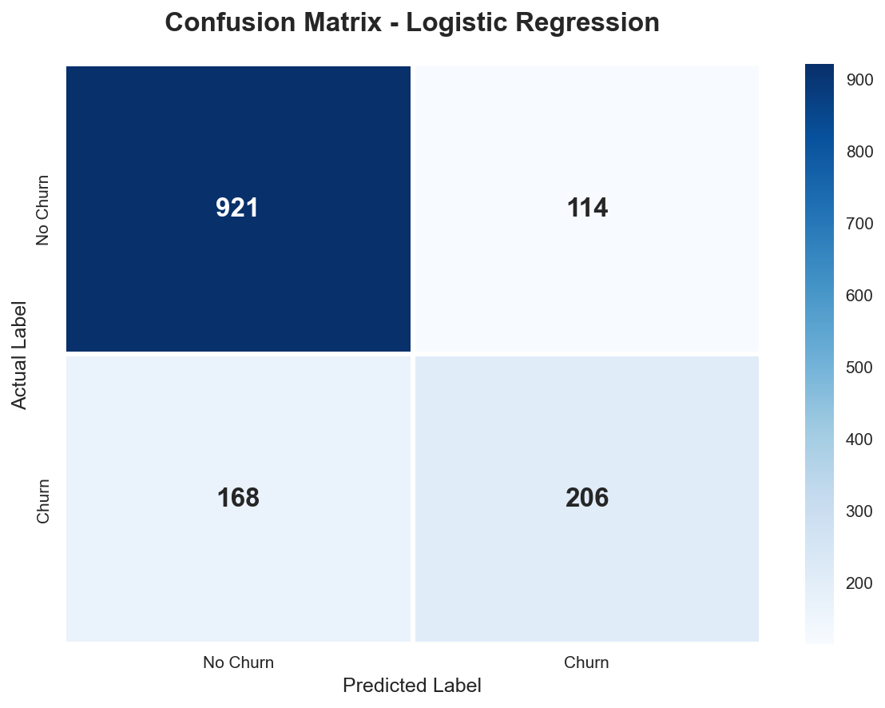
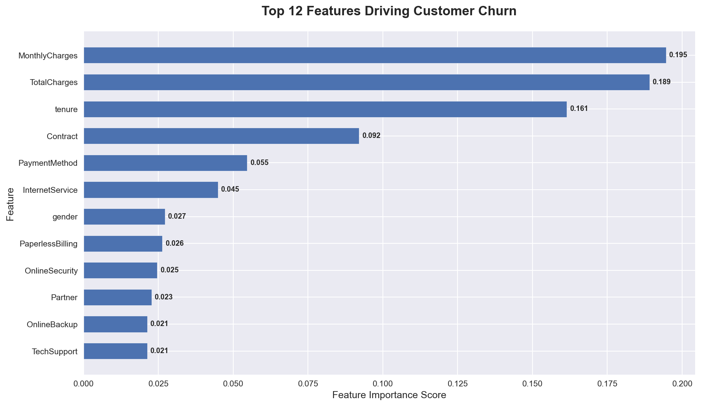

# 📉 Customer Churn Prediction

## 📌 Project Overview
A complete machine learning project predicting customer churn using 
classification algorithms on 7,043 real telecom customer records.
Includes full EDA, feature engineering, model training and comparison.

## 🎯 Business Problem
A telecom company wants to identify customers likely to cancel their
subscription before it happens so they can intervene and retain them.

## 📊 Key Business Insights Discovered
- ⚠️ 26.5% overall churn rate — 1 in 4 customers leaving
- 📋 Month-to-month contracts churn at 42.7% vs only 2.8% on 2-year contracts
- 👴 Senior citizens churn at 41.7% vs 23.6% for non-seniors
- 💰 MonthlyCharges is the single biggest churn driver
- 🕐 New customers (under 10 months tenure) are highest risk group

## 🤖 ML Models Trained and Compared
| Model | Accuracy |
|-------|---------|
| Logistic Regression | 79.99% |
| Decision Tree | 79.28% |
| Random Forest | 79.28% |

**Best Model: Logistic Regression with 80% accuracy**

## 📈 Visualizations
### Churn Distribution

### Contract Type and Tenure vs Churn

### Monthly Charges and Demographics vs Churn

### Model Accuracy Comparison

### Confusion Matrix

### Feature Importance

## 🛠️ Tech Stack
| Tool | Purpose |
|------|---------|
| Python 3.x | Core programming language |
| Pandas | Data manipulation |
| Matplotlib / Seaborn | Visualizations |
| Scikit-learn | ML models and evaluation |
| Jupyter Notebook | Interactive analysis |

## 📁 Project Structure
- data/ — Raw dataset (7,043 customer records)
- notebooks/ — Jupyter analysis and modeling notebook
- outputs/ — All 6 generated charts
- src/ — Python scripts
- README.md — Project documentation

## 📦 Dataset
- Source: IBM Telco Customer Churn Dataset
- Link: https://www.kaggle.com/datasets/blastchar/telco-customer-churn
- Size: 7,043 rows, 21 columns

## ▶️ How to Run
1. Clone this repository
2. Install requirements: pip install -r requirements.txt
3. Place churn_data.csv in the data/ folder
4. Open notebooks/churn_analysis.ipynb in Jupyter
5. Run all cells from top to bottom

## 👤 Author
Muhammad Usman — BS Data Science Student
LinkedIn: https://www.linkedin.com/in/muhammad-usman-157841269/
GitHub: https://github.com/dominator959